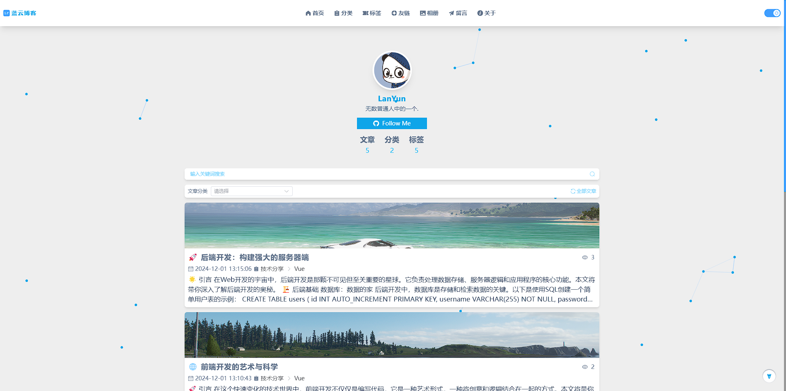
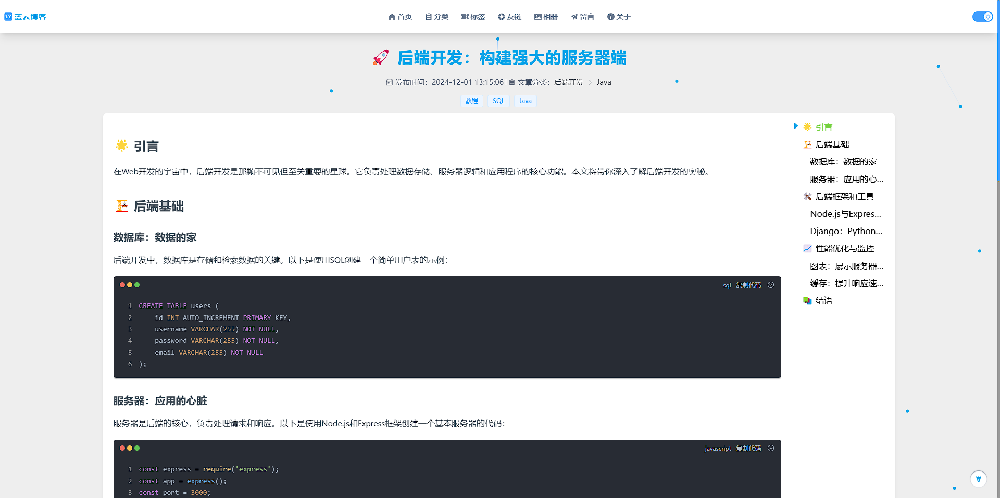
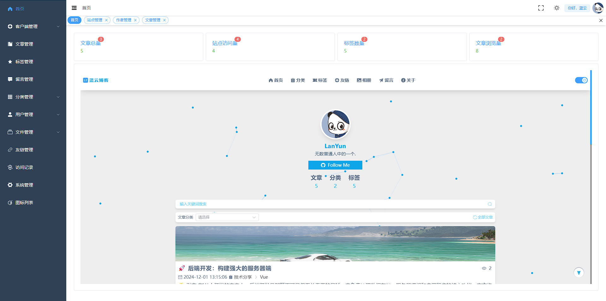
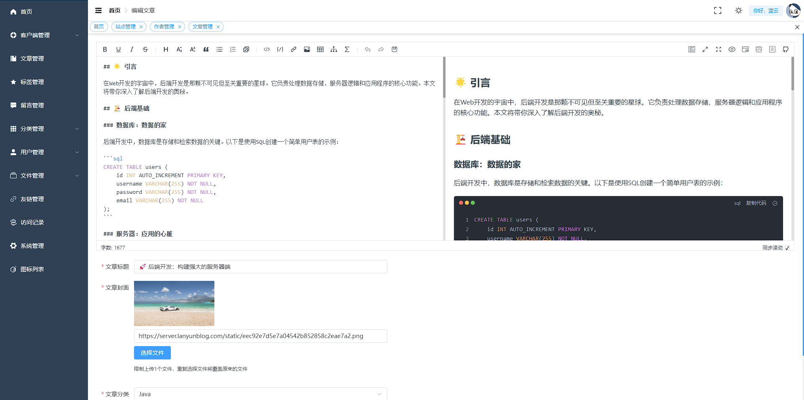

<br/>
<br/>
<br/>

<p align="center">
   
</p>

<h1 align="center" style="font-size: 26px; color: #409EFF;">蓝 云 博 客</h1>

<p style="font-size: 16px;" align="center">普普通通，平平无奇</p>

<p align="center"><a href="https://github.com/LanYun417/LanYunBlog.git">项目源码 🔗</a></p>

<p align="center">💝 QQ交流群：<a href="http://qm.qq.com/cgi-bin/qm/qr?_wv=1027&k=5mFNbq_kg4VW9sYIrsjubhsovn76fBMq&authKey=pSIfJpNNbUSkchH104ebtP%2BJugTD9y6%2BHkE1RV83ZWTZfhPTOIO0vR93%2BwGfDngi&noverify=0&group_code=316054036"  target="_blank">316054036</a> | 🐧 作者QQ：168847242 | 📩 邮箱：168847242@qq.com</p>

<p align="center">
   
   
   
   
   
   
   
</p>

```bash
$ git clone https://github.com/LanYun417/LanYunBlog.git
```

## 📢 项目介绍

蓝云博客是一个基于 Vue3 和 Nuxt3 构建的全栈博客平台，提供了一个简洁、高效的内容发布和管理界面。

## 🎄 技术栈

- **客户端**：Nuxt3、Pinia、Element Plus、Tailwind CSS
- **后台管理**：Vue3、Pinia、Element Plus、Tailwind CSS
- **后端接口**：NodeJS、Express

## 🎁 功能特性

- Nuxt3 SEO 优化，支持 SSR
- 支持 Markdown 编辑器，方便内容创作
- 响应式设计，适配多种设备
- 后台管理界面，轻松管理文章和用户
- 支持文章分类和标签管理

## 🍇 客户端启动（client）

```bash
# 安装依赖
$ npm install # Or yarn install

# 启动开发环境
$ npm run dev

# 构建生产环境
$ npm run build
```

## 🍉 后台管理启动（admin）

- 后台账号密码：admin / 123456

```bash
# 安装依赖
$ npm install # Or yarn install

# 启动开发环境
$ npm run dev

# 构建生产环境
$ npm run build
```

## 🍎 后端接口启动（server）

```bash
# 安装依赖
$ npm install # Or yarn install

# 启动开发环境
$ npm run dev

# 生产环境启动
$ npm start
```

## ⚠️ 后端接口补充

- 后端接口基于 Express 框架，使用 MySQL 作为数据库。
  需要在 config/db.config.ts 文件中配置数据库连接信息。
- 跨域说明：需要在 src/express/index.ts 文件中配置允许跨域的域名。
- 接口文档使用：[apidoc](https://apidocjs.com/)

### 部署

1. 客户端：将 `nuxt.config.ts` 中的 <em>baseUrl</em> 改为部署之后的后端接口的真实域名或 IP 地址

2. 后台管理：设置好 `.env.production` 中的环境变量 <em>VITE_BASE_URL</em> 为部署之后的后端接口的真实域名或 IP 地址

3. 后端接口：配置 `.env` 中的 <em>SERVER_HOST</em> 为部署之后的真实域名或 IP 地址，并修改好数据库的配置，以及允许跨域的域名/IP。

### nginx 配置

```nginx
# 后台管理，解决刷新 404 问题
location / {
  try_files $uri $uri/ /index.html;
}

# 后端接口，获取访问真实 IP 地址
location / {
  proxy_set_header X-Real-IP $remote_addr;
  proxy_set_header X-Forwarded-For $proxy_add_x_forwarded_for;
}
```

## 更新及修复

- 暂无

## 🎈 项目效果图

- 客户端
  
  
- 后台
  
  

## 🎉 贡献指南

欢迎对蓝云博客项目做出贡献。请遵循以下步骤：

1. Fork 项目
2. 创建新的分支
3. 提交你的更改
4. 创建 Pull Request

---
